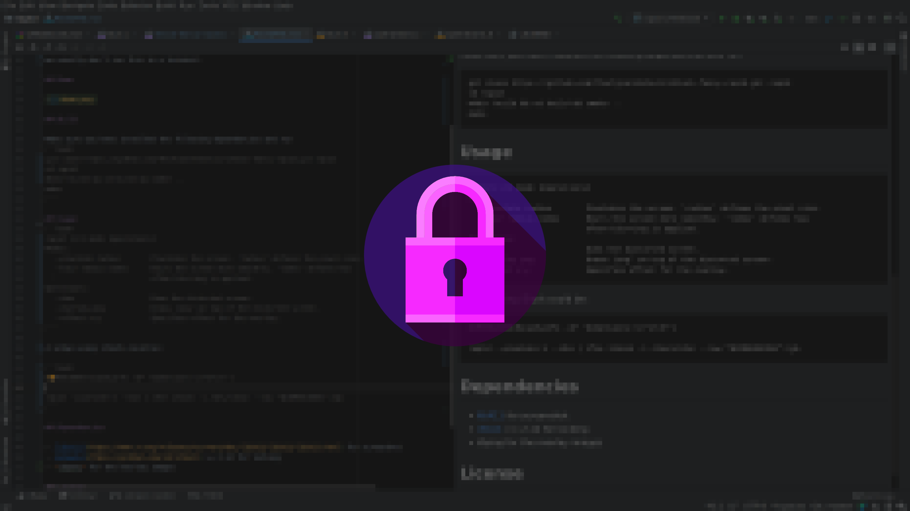

# rapid

A fork of `i3lock-fancy-rapid`:
A faster implementation of [i3lock-fancy](https://github.com/meskarune/i3lock-fancy). 
It is blazing fast and provides a fully configurable box blur. It uses linear-time box blur and accelerates using OpenMP.

Compared to the original, it offers overlay pngs and decouples the 
image generation from i3lock.
Also error messages are propagated through `notify-send` because
we usually don't run this in a terminal.

## Demo



## Build

Make sure you have installed the following dependencies and run
```bash
git clone https://github.com/ThorbjoernSchulz/i3lock-fancy-rapid.git rapid
cd rapid
mkdir build && cd build && cmake ..
make
```

## Usage
```bash
rapid [-h] mode [operations]
Modes:
  --pixelate radius        Pixelates the screen. 'radius' defines the pixel size.
  --blur radius:times      Blurs the screen more smoothly. 'times' defines how
                           often blurring is applied.
Operations:
  --dim                    Dims the distorted screen.
  --overlay png            Draws 'png' on top of the distorted screen.
  --offset x:y             Specifies offset for the overlay.
```

A setup using i3lock could be:

```bash
DIMENSIONS=$(xpdyinfo -oP 'dimensions:\s+\K\S+')

rapid --pixelate 5 --dim | ifne i3lock -i /dev/stdin --raw "$DIMENSIONS":rgb
```

where `ifne` costs you a little bit and might not be necessary if you know that
everythings stable.

## Dependencies

- [libX11](https://www.x.org/releases/current/doc/libX11/libX11/libX11.html) for screenshot
- *libpng* for the overlay images
- *notify-send* for error reporting

## License

[BSD 3-Clause](LICENSE)
